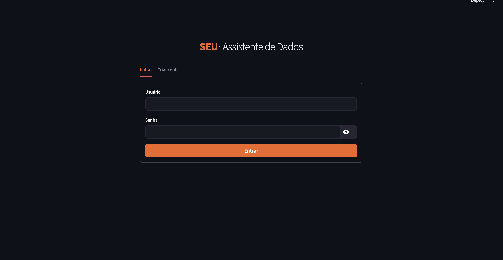
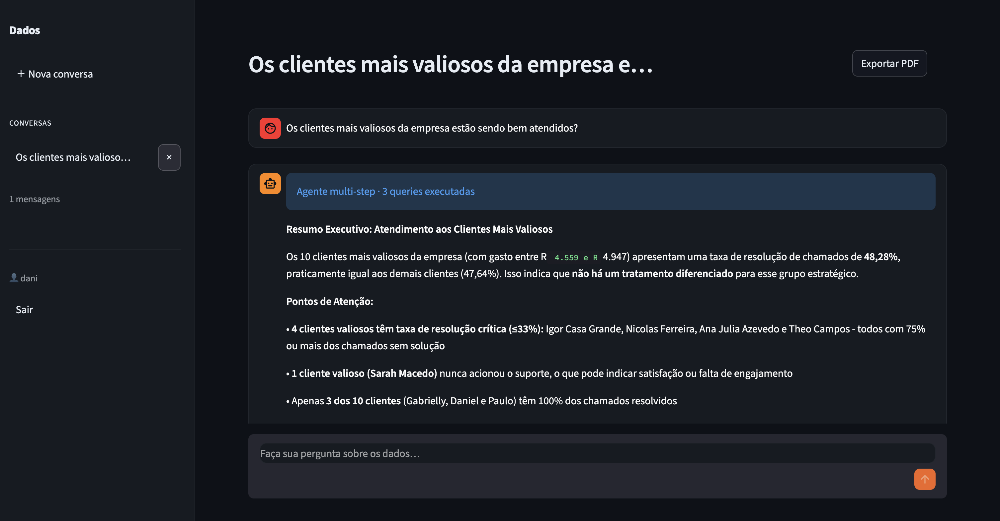
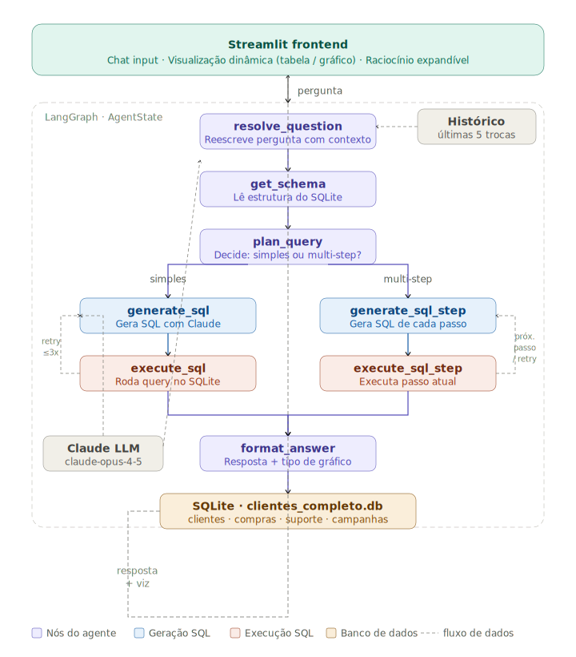
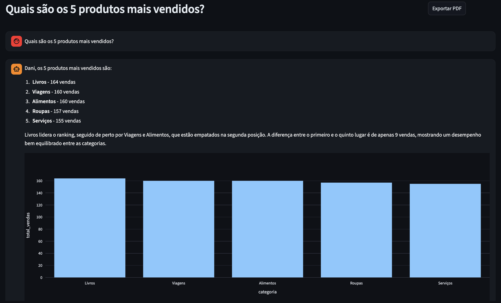
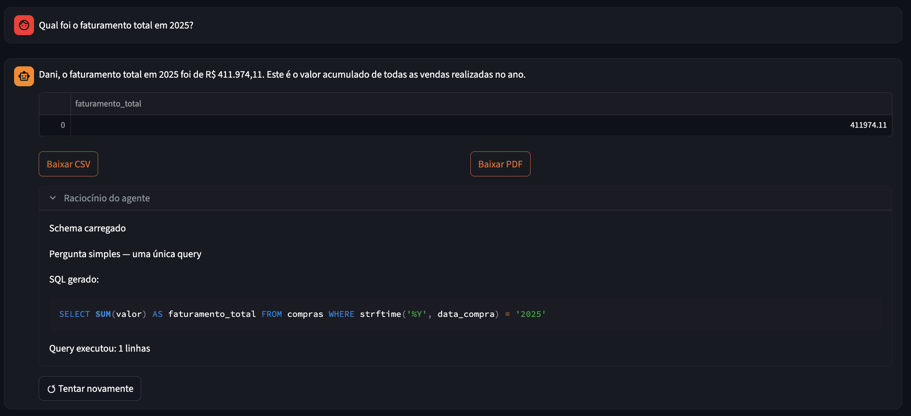
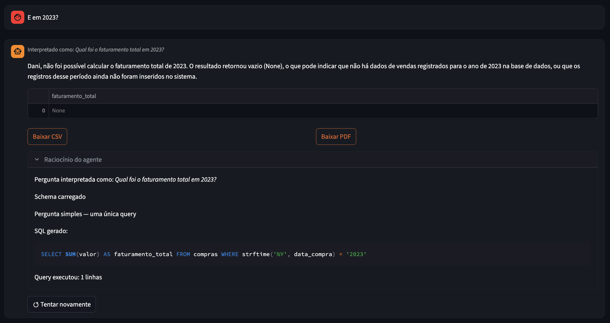
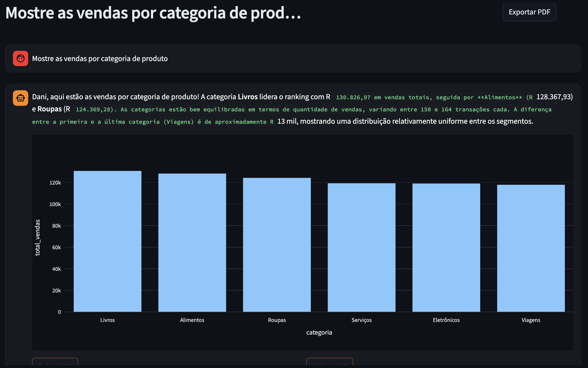
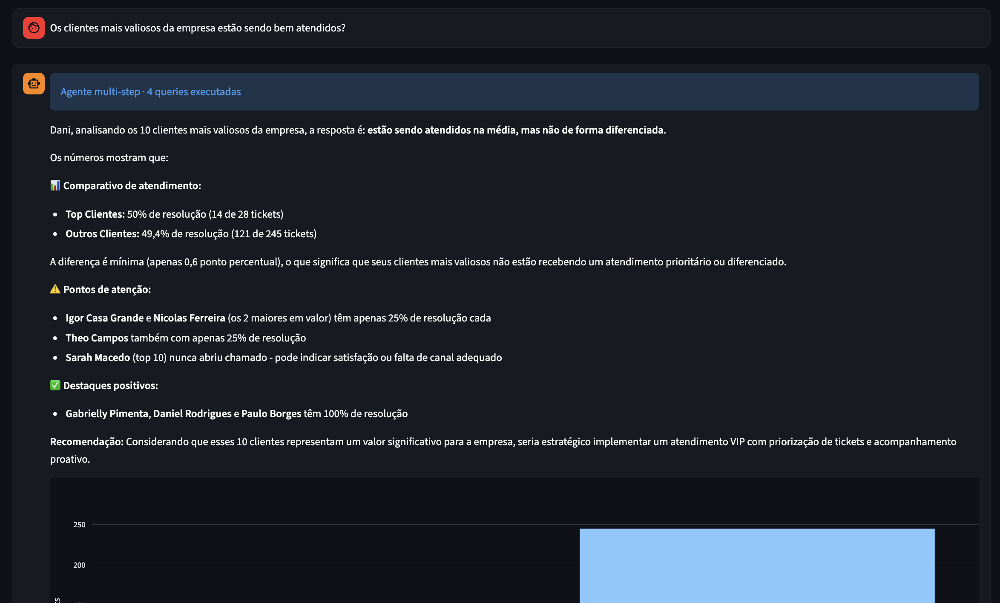
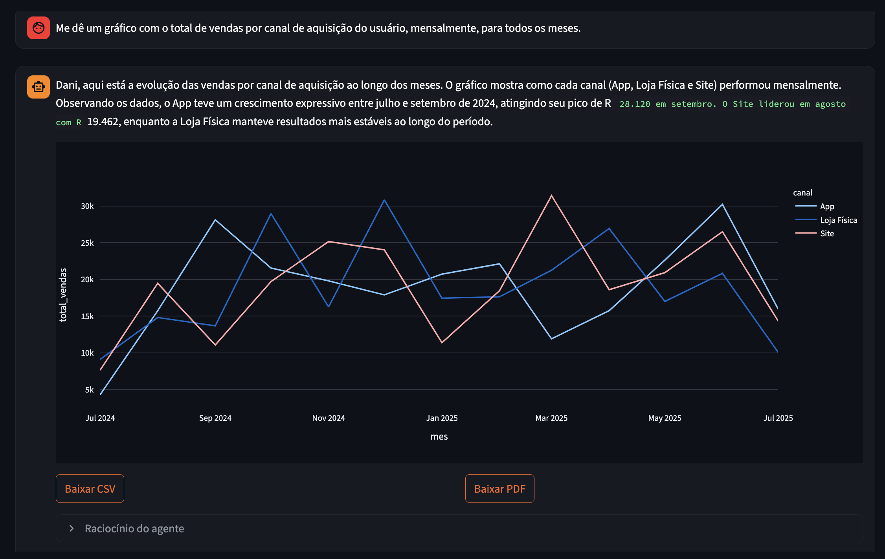

# 🤖 Assistente Virtual de Dados


> Analista de dados inteligente que responde perguntas de negócio em linguagem natural, consultando um banco de dados SQLite e apresentando os resultados com gráficos interativos, tabelas e exportação.

<p align="center">
  <p>
    
    
  </p>
</p>

## Visão Geral

O sistema funciona como um assistente: recebe uma pergunta em português, descobre a estrutura do banco de dados automaticamente, gera e executa a query SQL mais adequada, e apresenta o resultado de forma visual, além de exibir cada passo do raciocínio.

**Funcionalidades:**

- Autenticação com login/cadastro por usuário (PBKDF2-HMAC-SHA256 + salt)
- Histórico de conversas persistido por usuário em `db/app.db`
- Memória de conversa: perguntas de follow-up como *"e em 2023?"* funcionam sem repetir contexto
- Agente multi-step: detecta perguntas complexas e executa múltiplas queries, cruzando resultados
- Conversão de linguagem natural para SQL via Claude (Anthropic)
- Descoberta dinâmica do schema (sem queries hardcoded)
- Auto-correção: se a query falhar, o agente inclui o erro e tenta novamente (até 3 tentativas)
- Visualização automática: tabela ou gráficos, conforme o tipo de dado retornado
- Exportação do resultado como CSV ou PDF
- Painel de raciocínio expansível: exibe cada etapa e a query gerada
- Tentar novamente: Opção para fazer o agente reexecutar a pergunta anterior

## Instalação e Execução

### Pré-requisitos

- Python 3.10+
- Chave de API da Anthropic

### 1. Clone o repositório

```bash
git clone https://github.com/DaniOrze/assistente-virtual-dados.git
cd assistente-virtual-dados
```

### 2. Crie e ative o ambiente virtual

```bash
python -m venv venv

# Linux/Mac
source venv/bin/activate

# Windows
venv\Scripts\activate
```

### 3. Instale as dependências

```bash
pip install -r requirements.txt
```

### 4. Configure as variáveis de ambiente

Crie um arquivo `.env` na raiz do projeto:

```env
ANTHROPIC_API_KEY=sk-ant-sua-chave-aqui
```

### 5. Adicione o banco de dados

Coloque o arquivo `anexo_desafio_1.db` dentro da pasta `db/`:

```
db/
└── anexo_desafio_1.db
```

> O arquivo `db/app.db` (usuários e histórico) é criado automaticamente ao iniciar a aplicação.

### 6. Execute

```bash
streamlit run app.py
```

Acesse em: [http://localhost:8501](http://localhost:8501)


## Arquitetura

### Estrutura de arquivos

```
desafio_tecnico/
├── app.py              # Interface Streamlit (login, sidebar, chat, exports)
├── auth.py             # Autenticação e persistência do histórico (app.db)
├── requirements.txt
├── .env                # Chave da API
├── agent/
│   ├── graph.py        # Construção e compilação do grafo LangGraph
│   ├── nodes.py        # Lógica de cada nó do agente
│   ├── state.py        # TypedDict com 16 campos de estado compartilhado
│   └── tools.py        # Funções de acesso ao banco
├── tests/
│   └── test_nodes.py   # Testes unitários dos nós do agente
└── db/
    ├── anexo_desafio_1.db   # Dados de negócio — somente leitura
    └── app.db               # Usuários e histórico — criado na primeira execução
```

## Fluxo de Agentes

O agente é construído com **LangGraph** e opera como um grafo de nós com roteamento condicional. O estado é um `TypedDict` compartilhado entre todos os nós.

### Diagrama do fluxo



### Decisões de arquitetura

- **LangGraph** foi escolhido para tornar o fluxo de controle explícito e auditável. Cada nó é uma função Python pura que recebe e retorna estado — fácil de testar isoladamente.
- **Descoberta dinâmica de schema** garante que o agente funcione em qualquer banco SQLite sem configuração prévia.
- **Auto-correção por loop**: ao falhar, o nó `generate_sql` recebe o erro como contexto e tenta gerar uma query corrigida, até 3 vezes.
- **Separação de banco de dados**: os dados analíticos (`anexo_desafio_1.db`) nunca são alterados; usuários e histórico ficam em `app.db`, isolando responsabilidades.
- **Estado rico**: o `TypedDict` de estado carrega 16 campos — incluindo histórico de conversa, steps intermediários e raciocínio — permitindo que qualquer nó acesse o contexto completo da sessão.

## Exemplos de Consultas Testadas

### Consulta simples

> *"Quais são os 5 produtos mais vendidos?"*



---

### Consulta com filtro temporal

> *"Qual foi o faturamento total em 2025?"*



---

### Follow-up de conversa

> *"E em 2023?"*



---

### Consulta com agrupamento

> *"Mostre as vendas por categoria de produto"*



---

### Consulta multi-step

> *"Os clientes mais valiosos da empresa estão sendo bem atendidos?"*



---

### Consulta com gráfico

> *Me dê um gráfico com o total de vendas por canal de aquisição do usuário, mensalmente, para todos os meses.*




## Sugestões de Melhorias e Extensões

### Qualidade e confiabilidade

- **Validação semântica da SQL** — antes de executar, verificar se a query referencia apenas tabelas e colunas existentes no schema, evitando erros desnecessários e economizando tentativas de retry.
- **Cache de queries** — armazenar resultados de queries idênticas por sessão para reduzir latência e custo de API em perguntas repetidas.

### Experiência do usuário

- **Edição de mensagens** — permitir que o usuário edite o texto de uma pergunta anterior e reexecute o agente a partir daquele ponto, sem iniciar uma nova conversa.
- **Modo de compartilhamento** — gerar um link com visualização read-only de uma conversa específica, útil para apresentar análises a stakeholders.

### Infraestrutura

- **Suporte a bancos externos** — substituir SQLite por PostgreSQL ou DuckDB para análise de volumes maiores de dados, mantendo a mesma interface de agente.
- **Rate limiting por usuário** — controlar o número de requisições ao LLM por usuário/hora para controle de custos em deploys multiusuário.